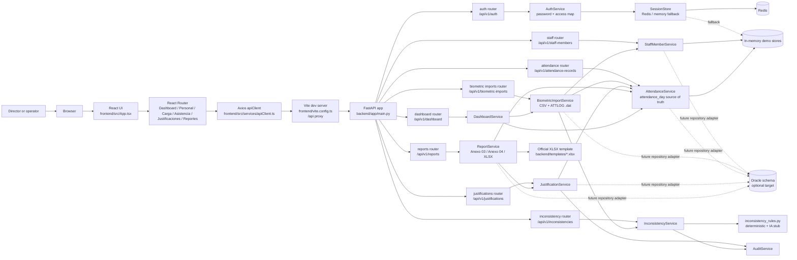
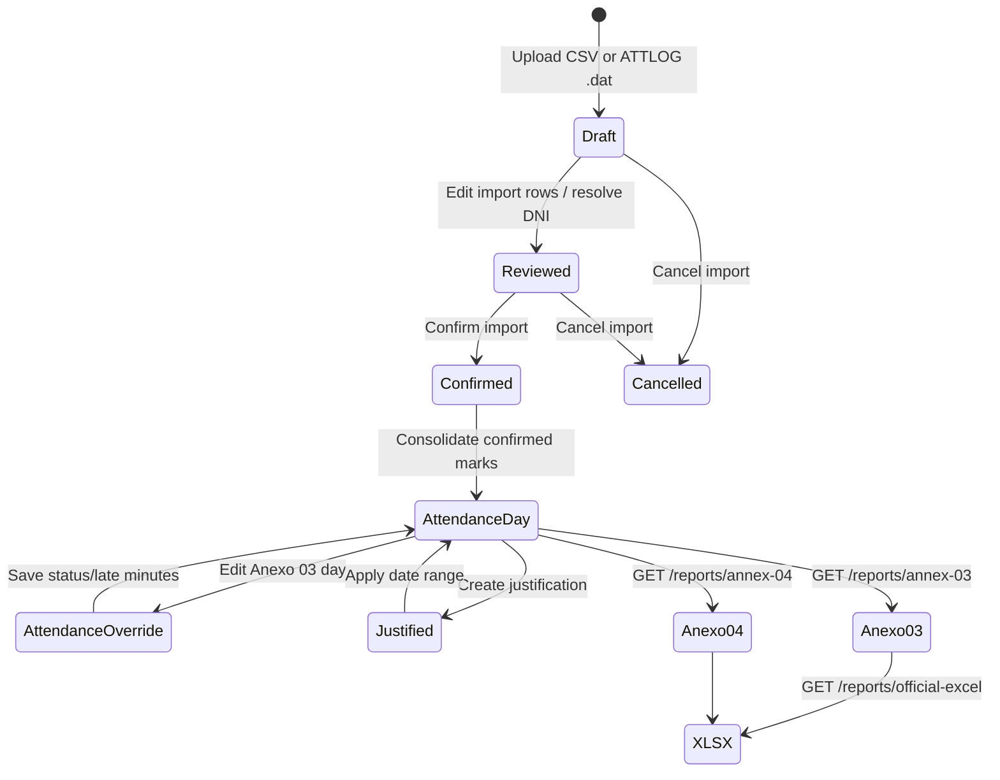

# CHIQUISTRUKIS Code Graph and Runtime Architecture

This document is the implementation map for the attendance system. It shows the modules a maintainer must understand before changing authentication, imports, attendance, justifications, or official reports.

## Quick orientation

| Concern | Entry point | Main implementation | Current persistence |
|---|---|---|---|
| Browser UI | `frontend/src/main.tsx` | `frontend/src/App.tsx` | Browser token/session storage |
| Browser API access | `frontend/src/services/apiClient.ts` | Axios client and 401 redirect | N/A |
| HTTP API | `backend/app/main.py` | `backend/app/api/*.py` | In-memory demo stores |
| Business rules | API routers delegate to `backend/app/services/*.py` | Service classes/functions | In-memory dictionaries/lists |
| Session state | `backend/app/services/session_store.py` | Redis with optional memory fallback | Redis or process memory |
| Official reports | `backend/app/api/reports.py` | `backend/app/services/report_service.py` | Attendance service + report overrides |
| Relational target | `database/` | Oracle schema, indexes, seed, checks | Optional/not wired into demo runtime |

## Full runtime graph

## Package and file graph

```mermaid
flowchart TB
  subgraph frontend[Frontend]
    main[frontend/src/main.tsx]
    app[frontend/src/App.tsx]
    css[frontend/src/styles.css]
    apiClient[frontend/src/services/apiClient.ts]
    vite[frontend/vite.config.ts]
    tests[frontend/test_*.mjs]
    main --> app
    app --> apiClient
    app --> css
    vite --> apiClient
    tests --> app
  end

  subgraph api[FastAPI API layer]
    mainpy[backend/app/main.py]
    deps[backend/app/api/deps.py]
    auth[backend/app/api/auth.py]
    staff[backend/app/api/staff_members.py]
    imports[backend/app/api/biometric_imports.py]
    attendance[backend/app/api/attendance.py]
    justifications[backend/app/api/justifications.py]
    reports[backend/app/api/reports.py]
    dashboard[backend/app/api/dashboard.py]
    inconsistencies[backend/app/api/inconsistencies.py]
    mainpy --> auth & staff & imports & attendance & justifications & reports & dashboard & inconsistencies
    auth & staff & imports & attendance & justifications & reports & dashboard & inconsistencies --> deps
  end

  subgraph services[Business services]
    auths[auth_service.py]
    sessions[session_store.py]
    staffs[staff_member_service.py]
    importsvc[biometric_import_service.py]
    attendancesvc[attendance_service.py]
    justsvc[justification_service.py]
    reportsvc[report_service.py]
    dashboardsvc[dashboard_service.py]
    inconsistency[ inconsistency_service.py]
    audit[audit_service.py]
    rules[rules/inconsistency_rules.py]
  end

  subgraph database[Database and operations]
    schema[database/01_schema/*.sql]
    seed[database/02_seed/01_seed_demo.sql]
    checks[database/03_checks/*]
    redis[infra/redis/docker-compose.yml]
    template[backend/templates/PLANTILLA-INFORME-ASIST-INICIAL-2021.xlsx]
  end

  app --> mainpy
  api --> services
  auth --> auths --> sessions
  staff --> staffs
  imports --> importsvc --> staffs
  imports --> importsvc --> attendancesvc
  attendance --> attendancesvc
  justifications --> justsvc --> attendancesvc
  reports --> reportsvc --> attendancesvc
  reports --> reportsvc --> template
  dashboard --> dashboardsvc --> attendancesvc
  inconsistencies --> inconsistency --> rules
  justsvc & inconsistency --> audit
  sessions --> redis
  services -. planned adapters .-> schema
  seed --> schema
  checks --> schema
```

## Domain flow graph

## API surface

| Router | Endpoints | Service path |
|---|---|---|
| Auth | `POST /api/v1/auth/sessions`, `GET/DELETE /api/v1/auth/sessions/current` | `AuthService`, `SessionStore` |
| Staff | `GET/POST /api/v1/staff-members`, `GET/PUT /{id}`, `POST /{id}/deactivation` | `StaffMemberService` |
| Imports | `GET/POST /api/v1/biometric-imports`, `GET /{id}`, `PATCH /{id}/rows/{row_id}`, `POST /{id}/confirmation`, `POST /{id}/cancellation` | `BiometricImportService` |
| Attendance | `GET /api/v1/attendance-records`, `PUT /api/v1/attendance-records/days` | `AttendanceService` |
| Justifications | `GET/POST /api/v1/justifications`, `PUT /{id}`, `POST /{id}/cancellation` | `JustificationService`, `AttendanceService` |
| Reports | `GET /api/v1/reports/annex-03`, `PATCH /annex-03/attendance`, `GET /annex-04`, `GET /official-excel` | `ReportService` |
| Dashboard | `GET /api/v1/dashboard/indicators` | `DashboardService` |
| Inconsistencies | `GET /api/v1/inconsistencies`, `POST /{id}/review`, `POST /{id}/correction` | `InconsistencyService`, `AuditService` |
| Health | `GET /api/v1/health` | `backend/app/main.py` |

## Invariants for maintainers

1. `attendance_day` is the effective attendance source used by Anexo 03, Anexo 04, and XLSX export.
2. A report override with `status: "none"` removes the temporary override for that staff/date.
3. Date values must be valid ISO dates and belong to the requested month/year.
4. Justification creation uses `multipart/form-data` because support files are optional uploads.
5. The frontend calls relative `/api` paths; Vite proxies them to the backend during development.
6. Session persistence is Redis-first, with memory fallback only when explicitly enabled by configuration.
7. The current demo store is process memory. Restarting the backend reseeds demo state; it does not migrate data to Oracle.
8. Database scripts are idempotent and must not be replaced with destructive cleanup commands.
9. The official workbook is template-based so merged cells, styles, formulas, validations, and hidden support sheets survive generation.

## Change navigation

- Change UI behavior: start at `frontend/src/App.tsx`, then `frontend/src/styles.css`, then the matching E2E script.
- Change an API contract: update the router, service behavior, and the frontend API call together.
- Change attendance semantics: update `AttendanceService`, `ReportService`, and unit tests; verify both Annex 03 and Annex 04.
- Change imports: update `BiometricImportService`, its router, import tests, and the draft/confirmation UI.
- Change persistence: first define the repository adapter boundary; do not silently replace demo stores in a service method.
